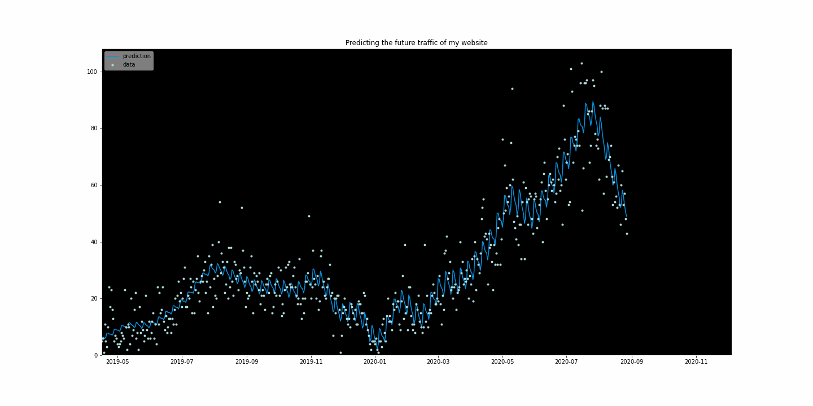

  

<h1>Hi 👋, I'm Sameer Raj</h1>

💡 Aspiring Data Analyst  
🐍 Python | 🧮 SQL | 📊 Power BI  
📧 sameerraj2106@gmail.com  

  

---

<table style="width:100%; border: none;">
  <tr>
    <td style="padding: 20px; background-color: #f5f5f5; border-radius: 10px; vertical-align: top;">

  
<strong>🔍 Passionate about exploring data and uncovering insights</strong>

  
📊 Building dashboards using <strong>Power BI, Excel</strong>, and <strong>Tableau</strong>

  
🐍 Experienced in <strong>Python (pandas, matplotlib, seaborn)</strong> and <strong>SQL</strong>

  
🎓 Certified in <strong>Google Data Analytics</strong> and <strong>Advanced SQL (HackerRank)</strong>

  
🌱 Constantly learning through <strong>Kaggle, YouTube</strong> & community projects

  
📬 Reach me at: <a href="mailto:sameerraj2106@gmail.com">sameerraj2106@gmail.com</a>

  </td>
  <td style="padding: 20px; background-color: #f5f5f5; border-radius: 10px;">
    
  </td>
  </tr>
</table>

---

<h3 align="center">🌐 Connect with Me</h3>

  
  
  
  

---

<h3 align="center">⚒️ Tools & Technologies</h3>

  
  
  
  
  
  
  

---

<h3 align="center">📜 Certifications</h3>

- ✅ [Google Data Analytics – Coursera](https://coursera.org/share/c6ed084cb479c65335c06698237491ec)  
- ✅ [SQL (Advanced) – HackerRank](https://www.hackerrank.com/certificates/edc8bff78539)

---

<h3 align="center">📈 GitHub Stats</h3>

  

  

  

---
> 🔁 Regularly learning, building, and exploring the world of data  
>   
> 🧠 *“Data is the new oil – but insights are the real gold.”*  
> — Sameer Raj

